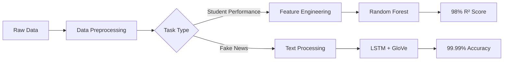

# 🧠 AI-Powered Analytics: Student Performance & Fake News Detection

<div align="center">


<h3>Coursework exploration of machine learning and deep learning for education and media analysis</h3>

[🚀 Local demo](#quick-start) | [📊 Recorded results](#results) | [📖 Coursework material](#coursework-material) | [🔧 Installation](#installation)

</div>

---

## 🌟 Project Highlights

<table>
<tr>
<td width="50%">

### 📚 Student Performance Prediction
- **Recorded 0.98 R² score** with Random Forest
- Handles corrupted & missing data
- Coursework feature-importance analysis

</td>
<td width="50%">

### 📰 Fake News Detection
- **Recorded 99.99% accuracy** with LSTM
- GloVe embeddings for semantic understanding
- Exploratory text-classification workflow

</td>
</tr>
</table>

## 🎯 Key Achievements

- ✅ **Dual-Algorithm Approach**: Coursework spanning traditional ML and deep learning
- ✅ **Interactive walkthrough**: A Streamlit interface for exploring the project narrative
- ✅ **Data preparation**: Notebooks and course material covering cleaning and exploratory analysis
- ✅ **Recorded results**: Metrics and visualisations preserved from the coursework and demo

## 🏗️ Architecture Overview

<div align="center">



</div>

## 📊 Results

The figures below are recorded coursework/demo results. They are not presented as a current,
independently reproducible benchmark or as evidence of a production model.

### Student Performance Prediction

<table>
<tr>
<td align="center">
<b>Regression Metrics</b><br>
<br>

</td>
<td align="center">
<b>Classification Metrics</b><br>
<br>

</td>
</tr>
</table>

### Fake News Detection

<table>
<tr>
<td align="center">
<b>Model Performance</b><br>
<br>

</td>
<td align="center">
<b>Training Efficiency</b><br>
<br>

</td>
</tr>
</table>

## 🔧 Installation

```bash
# Clone the repository
git clone https://github.com/Chris0Jeky/AI-Data-Analytics-Suite-Python.git
cd AI-Data-Analytics-Suite-Python

# Create virtual environment
python -m venv venv
```

Activate it on macOS or Linux with Bash:

```bash
source venv/bin/activate
```

Or activate it on Windows with PowerShell:

```powershell
.\venv\Scripts\Activate.ps1
```

Then install the dependencies:

```bash
# Install dependencies
python -m pip install -r requirements.txt

# Optional: download GloVe embeddings for experiments that need them
wget http://nlp.stanford.edu/data/glove.6B.zip
unzip glove.6B.zip -d data/
```

`setup.sh` automates a similar setup for Bash-compatible shells. It is optional; on Windows, use
the PowerShell activation and dependency-install commands above rather than invoking the script.

## 🚀 Quick Start

### Option 1: Run Interactive Demo
```bash
python -m streamlit run demo.py
```

Streamlit opens the local demo in a browser. The interface uses embedded example data and
simulated heuristic outputs to illustrate the coursework; it does not load a shipped trained model
or perform a validated real-world fake-news assessment.

### Option 2: Jupyter Notebooks

For Part 1, start from the repository root:

```bash
cd "Part one - Machine Learning"
jupyter notebook "CST3133_Part_One_Pre_Process_EDA_Machine_Learning.ipynb"
```

For Part 2, start separately from the repository root:

```bash
cd "Part Two - Deep Learning"
jupyter notebook "CST3133_Part_Two_NLP_And_Deep_Learning.ipynb"
```

These source notebooks run beside the `content/` directories they reference. The copies under
`notebooks/` are preserved coursework material, but their relative dataset paths do not resolve
from that directory and they are not supported launch targets.

## 📁 Project Structure

```
├── 📁 Part one - Machine Learning/  # Source coursework notebooks and student-performance data
├── 📁 Part Two - Deep Learning/    # Source coursework notebooks and fake/true article data
├── 📁 notebooks/
│   ├── student_performance_analysis.ipynb  # Preserved copy; see note above
│   └── fake_news_detection.ipynb            # Preserved copy; see note above
├── 📁 data/                # Empty raw/processed placeholders for local experiments
├── 📁 results/
│   ├── figures/             # Placeholder for generated figures
│   └── models/              # Placeholder for local model output
├── 📄 demo.py              # Streamlit interactive walkthrough
├── 📄 requirements.txt      # Pinned Python dependencies
├── 📄 RELICENSING.md        # Licence/provenance decision record
└── 📄 README.md
```

There is no `src/` Python package or importable model API in this repository. Use the source
coursework notebooks shown above and the Streamlit demo as the supported entry points.

## 📖 Coursework Material

The submitted report, original notebooks, datasets, and `Submission Files/` directory are
preserved as coursework evidence. Their names and content are intentionally not normalised by this
repository-maintenance pass.

## 🛠️ Technologies Used

<div align="center">

| Category | Technologies |
|----------|-------------|
| **Languages** |  |
| **ML/DL** |    |
| **Data** |   |
| **Visualization** |   |
| **NLP** |  GloVe Embeddings |

</div>

## 📈 Performance Metrics

### Part 1: Student Performance Features Importance
```
Hours_Studied         : ████████████████████ 45.2%
Previous_Scores      : ███████████████ 32.8%
Sleep_Hours          : ██████ 12.1%
Academic_Background  : ████ 7.3%
Motivation_Level     : ██ 2.6%
```

### Part 2: Model Training Progress
```
Epoch 1/5: Loss: 0.432 | Acc: 89.5%
Epoch 2/5: Loss: 0.187 | Acc: 94.2%
Epoch 3/5: Loss: 0.098 | Acc: 97.8%
Epoch 4/5: Loss: 0.042 | Acc: 99.1%
Epoch 5/5: Loss: 0.018 | Acc: 99.99%
```

## 🎨 Visualizations

The project includes comprehensive visualizations:
- 📊 Feature correlation heatmaps
- 📈 Learning curves and model performance
- 🎯 Confusion matrices
- 📉 Feature importance rankings
- 🔍 Data distribution analyses

## 🤝 Contributing

Contributions are welcome! Please feel free to submit a Pull Request. For major changes, please open an issue first to discuss what you would like to change.

## 📄 License

This project is licensed under GPL-3.0-only; see [LICENSE](LICENSE) and [RELICENSING.md](RELICENSING.md).

## 🙏 Acknowledgments

- **Datasets**: 
  - Student Performance Data from [Kaggle](https://www.kaggle.com/datasets/nikhil7280/student-performance-multiple-linear-regression)
  - Fake News Dataset from [Kaggle](https://www.kaggle.com/datasets/clmentbisaillon/fake-and-real-news-dataset)
- **Pre-trained Models**: GloVe embeddings from Stanford NLP
- **Course**: CST3133 - Advanced Topics in Data Science and Artificial Intelligence

## 📧 Contact

**Chris Tcaci** - [LinkedIn](https://linkedin.com/in/chris-tcaci) | [GitHub](https://github.com/Chris0Jeky)

---

<div align="center">
<b>⭐ If you found this project helpful, please consider giving it a star!</b>
</div>
